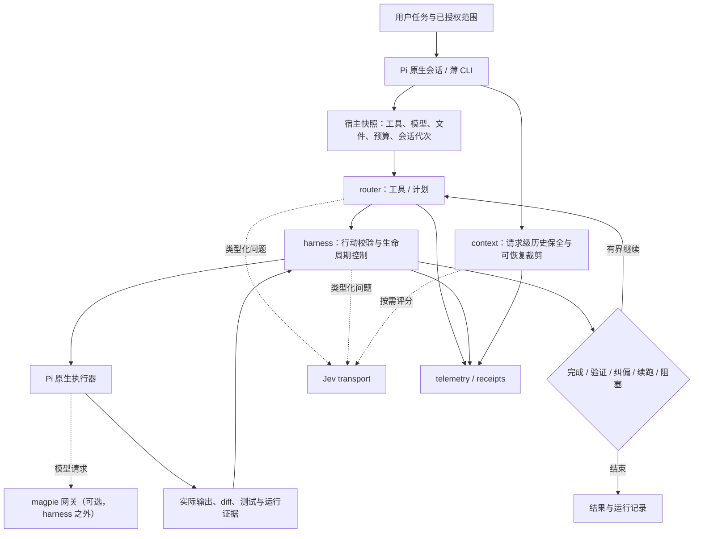

# pi-jev-harness 技术方案

日期：2026-09-27。目标目录：`<repo>`。

状态：首版已实现（2026-09-28），按第 16 节实施状态核对；本文其余内容仍为技术规格。第 1 至 15 节依据四个本地工作副本的核心入口、函数、协议与调用关系，以及本机 Pi 的随包文档编写，编写时未调用真实 Jev/provider，未重跑测试。其中的目标文件、接口、命令、阈值策略和阶段验收是设计规格，实际实现与偏差见第 16 节。

**决策记录（2026-09-28）：模型路由由 magpie 负责。** 用户决定 jev 的模型路由统一改由 magpie（https://github.com/yetone/magpie）负责，删除 harness 中的模型路由代码（`src/router/models.ts`、`window.ts` 及其接线）。具体含义：
- harness 不再选择模型或 effort，不做跨模型窗口检查，也不在会话中切换模型；`router.models` 配置与 `RouteDecision` 的模型部分随之删除。
- 模型由用户在 Pi 中选定，常见为 magpie 的模型或路由组（`group/<id>`）；magpie 的路由组决定每次请求由哪个成员模型或账号服务。
- 工具路由（`src/router/tools.ts`、`jev_route` 的工具建议、on 模式下应用工具集合并让 bash 常驻）和计划校验（`src/router/plan.ts`）仍在 harness 内，不受本决定影响。
- harness 的范围为：工具路由与计划校验、动作评审、证据收集、完成验收、有界续跑、上下文裁剪和运行记录。

下文按此改写；第 2 节与第 15 节中 O 的模型路由来源条目只作为历史记录保留，第 16 节模型路由相关的实施记录改标为“已移除”。

文档分工：本文件是唯一技术方案，维护架构、来源文件与函数、接口契约、配置、实施顺序和技术验证。面向使用者的定位、使用流程、命令体验、状态与产品验收统一维护在 [产品与使用说明](pi-jev-harness-product.md)。两份主文档直接维护在 `docs/`；本方案后续原位更新，不再另建日期化的平行方案。

## 1. 结论与产品定位

**构建一个以 Pi 为运行宿主的开发任务 harness：router 决定用什么工具和执行计划（模型路由交给 magpie）；harness 管理行动证据、验证、纠偏与有界续跑；Jev 提供类型化判断。**

复用 Pi 的模型调用、工具执行、会话、取消和持久化能力。新项目提供一个可安装的扩展入口和一个薄 SDK 命令行入口，使用同一套业务实现。第一版采用单仓库、单 TypeScript 包，公开 `router`、`harness` 两个独立子入口；上下文压缩、Jev transport、观测是内部支撑模块。OMP 使用独立适配入口，不能把 OMP 类型强制转换成 Pi 类型后宣称兼容。

第一版要交付的闭环是：**收到开发任务 → 选择工具（模型由用户或 magpie 决定） → 原生执行 → 收集实际证据 → 验证 → 完成或有界续跑 → 可回放的结果记录**。支持读代码、修改已有文件、新建文件及执行已授权的检查；多智能体 DAG 调度不是首版闭环的前提。

优化目标按顺序是：任务正确完成、端到端耗时降低、总体费用可解释。减少 token、Jev 判断次数或模型单次响应时间，只作为解释指标，不能单独认定提效。

## 2. 来源基线与吸收原则

以下 commit 为编写本方案时核对的固定 revision，不表示远端最新版本。

| 代号 / 项目 | 来源与固定 revision | 当前状态 / 许可 |
| --- | --- | --- |
| R / typesafe-router | [TypeSafeAI/typesafe-router](https://github.com/TypeSafeAI/typesafe-router)，`4c6855ccfc92ff0e40a71661685c9ead327a3715` | 工作树干净；未找到 LICENSE/LICENCE/COPYING/NOTICE，package.json 未声明 license。现阶段参考接口与行为要求，不复制源码、测试或 UI；复制前补齐授权依据。 |
| H / jev-harness | [TypeSafeAI/jev-harness](https://github.com/TypeSafeAI/jev-harness)，`44a4e3a17013b6458efd4cc2b3e8ca45efae60b8` | 工作树干净；MIT。主要吸收纯契约、工具路由、校验、回放方法与离线用例。 |
| O / omp-jev-extensions | [luw2007/omp-jev-extensions](https://github.com/luw2007/omp-jev-extensions)，最终核对基线 `0f93c809c2088c61fab4e613807e515ff9e65b1a` | MIT；调研开始时为 `a9283d20f193789599f090e617252df8cce87e91` 且 router 有既有修改，核对时已推进至两个新提交。 |
| C / omp-jev-compaction | [jerryfane/omp-jev-compaction](https://github.com/jerryfane/omp-jev-compaction)，`e21ab3273542a07984c4f2cfc4b3e746dc95930c` | 工作树干净；MIT。其 fast-jev 内核另固定于 `e3f262a7f4d42bd8dd32ced30d26176f7cb545b0`。 |

C 的内核来源为 [tamaratran/fast-jev-compaction](https://github.com/tamaratran/fast-jev-compaction)，必须同时保留外层 MIT 与 `LICENSE.upstream`。O 中的 compaction 记录的外层集成基线为 `3719495ceb109c0d6e40d29053675f0d6ecb2e9f`。本轮比较两份 `hook.ts`，差异集中在 telemetry 导入和导出类型；新项目只维护一个压缩内核，吸收适配差异，不保留两套平行实现。

H 的部分 contract 来自 typesafe-playground，文件头固定了来源 `6fe5967dc020521a0731682b06c4d8eeeab95ffb`；迁移时保留这些归属信息。O 的 foreman 另有引用 `thruwire/foreman policy.py` 的注释，迁移该策略前补核其来源和许可；未完成前保留其需求描述，独立实现本项目决策表。

本机已安装的 Pi 包为 `@earendil-works/pi-coding-agent@0.87.1`，Node 要求 `>=22.19.0`。将它作为首个适配与验证目标，不把本地 OMP 文档中的版本号视作本轮运行认证。[Pi SDK][pi-sdk] [Pi 扩展][pi-extensions]

并行变化记录：O 新增 `8f4ddff`（provider 角色回退）及 `0f93c80`（model-selector gate）。本方案补读了这些函数及调用点，未验证其运行行为；最后核对的 `all-model-router.ts` SHA-256 为 `7e3eaf789fc65907dde63d4eed9883291b975b306a24ac17a9f9308e177bc3df`。来源仓库的早期 [OMP-first 草案][o-other-plan] 仅作为历史背景，不作为本项目维护入口。当前方案采用 Pi-first，并把真实执行记录与纯评审证据分开；这次文档整理不改变该设计，也不代表已经实施或启用。

## 3. 架构与职责



| 模块 | 拥有的职责 | 不拥有的职责 |
| --- | --- | --- |
| router | 从宿主提供的候选中选择工具与计划；输出原始选择、有效选择、原因、工具依赖与上下文需求 | 文件写入、工具执行、用户授权、独立续跑循环；模型与 effort 选择（由 magpie 负责） |
| harness | 行动校验、证据关联、checkpoint、验证、完成判定、有界续跑 | 重新实现 provider SDK、Pi 会话存储、通用 agent loop |
| context | 请求级消息裁剪、缓存身份、spill/recall、必要时提供压缩候选 | 隐式修改会话日志、扩大读权限、重新执行被裁掉的操作 |
| Jev transport | 网络、取消、限额、严格解析、调用计量 | 将模型判断解释成权限，统一所有业务失败语义 |
| adapter | 翻译真实宿主事件和类型；执行已批准的宿主操作；收集真实结果 | 用类型断言替代宿主行为验证 |

纯决策函数不访问环境变量、文件系统或网络；计量由调用者负责。

## 4. 按项目的文件与函数吸收清单

本节的源函数均来自本轮核对的工作副本；“目标”均为新项目拟实现路径。迁移采用依赖闭包和必要测试，不复制整个应用目录。2026-09-28 模型路由交给 magpie 后，只服务于模型路由的条目不再吸收，已从下表删去或改写，并在对应小节末尾列出。

### 4.1 R：吸收闭集路由的接口与解释能力

由于许可未确认，下列条目目前是行为参考；实现优先基于 H 的 MIT 核心与官方协议，不能直接 vendor R。

| 能力 | 源文件与函数 | 新项目目标 | 处理方式 |
| --- | --- | --- | --- |
| 统一的工具选择接口 | [lib/jevRouter.ts][r-router]：`createRouter()`、`routeWithJev()`；[types/router.ts][r-types]：`RouteDecision`、`ResolvedRoute` | `src/router/types.ts` | 保留原始与有效选择、source、置信度、reason 的分离。模型选择部分不再吸收。 |
| 候选与 fallback 约束 | [lib/jevRouter.ts][r-router]：`assertValidRequest()`、`assertFallbackOption()`、`resolveFallback()` | 工具侧使用 H；模型侧不再吸收 | 保留唯一 ID、必要 fallback、无工具需求与需要澄清的区别。服务异常标记 unavailable；不伪造选择。 |
| 可检查的请求构造 | [lib/jevRouter.ts][r-router]：`buildRouterContext()`、`buildRouterQuestion()`、`buildJevRequest()` | `src/jev/wire.ts` | 只序列化明确白名单字段；原始源码、描述与任务都是待分类数据，不能成为执行指令。 |
| 错误类别与 wire 适配 | [lib/jevClient.ts][r-client]：`toWireRequest()`、`describeHttpError()`、`normalizeAnswers()`、`callJev()` | `src/jev/client.ts`、`wire.ts` | 参考错误分类；不继承概率 clamp、缺失字段补值、接受非对应题目回答的宽松行为；超时覆盖整个响应体。 |

不吸收 Next.js lab、React 组件、浏览器 API key 存储、演示关键词 mock、UI 导出机制。它们不是开发任务执行链路的必要部分。

### 4.2 H：作为工具路由和提案评审的主要代码来源

| 能力 | 源文件与函数 | 新项目目标 | 必要适配 |
| --- | --- | --- | --- |
| 宿主工具目录 | [src/routing/catalog.ts][h-catalog]：`createCatalog()` | `src/router/tools.ts::snapshotToolCatalog()` | 从实际已注册工具生成目录，保留能力、schema、来源与可用状态；不虚构工具 ID。 |
| Top-k 工具选择 | [src/routing/route.ts][h-route]：`routeTools()`、内部 `parseEvidence()` | `src/router/tools.ts::routeToolsForTask()` | 保留完整分布、模型 pin、argmax、阈值、闭集和确定性成本排序；其 cost 是每工具限制，另加整包限制。 |
| schema 装载与对照 | [src/routing/context.ts][h-context]：`assembleContext()`；[src/routing/prepare.ts][h-prepare]：`prepareToolContext()` | `src/router/tools.ts::prepareToolExposure()` | 使用 full/lean、added/evicted 比较；shadow 保持基线工具曝光。不要把该 context 功能误称为历史文本压缩。 |
| 工具依赖补全 | [src/routing/bundle.ts][h-bundle]：`assembleToolBundle()` | 同上 | 路由后显式调用；`prepareToolContext()` 不会自动补依赖。top-k 只限制根工具，读文件等前置能力另列；依赖不可用时整包 withheld。 |
| 单文件提案结构校验 | [src/contract/validate.ts][h-validate]：`proposalSchema`、`checkPath()`、`validateProposal()`；[diff.ts][h-diff]：`parseUnifiedDiff()` | `src/harness/actions.ts` + `vendor/jev-harness/` | 保留现有文件、单文件 unified diff 的原始契约。真实 FS、符号链接、最新内容、新建文件及命令动作由新增宿主校验处理。 |
| 四问题评审 | [src/contract/review.ts][h-review]：`buildReviewPayload()`、`readNoul()`、`parseReviewAnswers()`、`reviewProposal()`；[payload.ts][h-payload]：`validateReviewPayload()` | `src/harness/review.ts` | 先结构校验再发送；保留取消前后检查和 question set v4；固定模型，不伪造缺失的响应模型。 |
| 确定性评审结论 | [src/contract/decide.ts][h-decide]：`decide()`、`unfavorable()` | `src/harness/review.ts::decideActionReview()` | 区分 permit / proposal_only / reject / unavailable。permit 是评审证据，不是授权。`decideBase()` 留在离线基准中。 |
| 内容绑定与回放 | [src/audit/receipt.ts][h-receipt]：`canonicalJson()`、`createBoundReceipt()`、`replayBoundReceipt()` | `src/harness/receipt.ts` | 复用规范化和绑定方法；生产记录使用新 schema。原 receipt 强制 fixtureId、good/bad 和 applied=false，不能直接套用。 |
| 有界 HTTP 与请求台账 | [examples/host/jev-choice.ts][h-transport]：`boundedText()`、`jevChoiceBody()`、`createJevChoiceRouter()` | `src/jev/client.ts` | 提取流式响应上限、总 deadline、每个物理请求计量、取消与错误出口；移除 demo 状态依赖。默认一次请求，不自动启用恢复重试。 |
| 独立评估方法 | [src/benchmark/evaluation.ts][h-evaluation]：`summarizeEvaluation()`、`prepareProposerInput()` | `bench/` 与离线 fixtures | 保留盲化输入、歧义标签和失败计数。mock 只验证流程，不证明 Jev 准确率或提效。 |

不吸收 `examples/host/codex.ts::runCodex()` 作为生产执行器：它是合成 fixture 的实验入口。也不吸收 Next.js Arena、持久化浏览器密钥或只面向 benchmark 的成功标签。

### 4.3 O：吸收真实宿主集成与开发任务控制策略

| 模块 / 能力 | 源文件与函数 | 新项目目标 | 必须改变或保留的边界 |
| --- | --- | --- | --- |
| 子任务计划契约 | [route-planner/route-schema.ts][o-plan]：`validateRoutePlanInvariants()`；[route-jev.ts][o-plan-jev]：`buildRouteState()`、`buildRouteQuestions()`、`askJevRoutePlan()` | `src/router/plan.ts` | 保留 direct/single/parallel/dag、依赖、角色、target/change/acceptance 校验。第一版执行 direct/single；其余只有宿主声明支持后才能分发。 |
| 计划输入构造 | [route-planner/route-agent.ts][o-plan-agent]：`deriveCandidateSlices()`、`routeAgentExtension()` | `src/router/plan.ts::validateTaskSlices()` | 不直接沿用按项目符号切分及英文关键词推断只读的启发式。主模型先给出具体切片、范围、验收；Jev 选择已有候选。single 合并时保全全部验收项。 |
| 轻量验收 | [acceptance-gate/stop-jev.ts][o-acceptance]：`runAcceptanceGate()`、`stopJevExtension()` | `src/harness/completion.ts` | 拆开 stopAllowed 与 completionStatus。服务失败为 unavailable，不能 accepted=true；依据宿主证据，不仅是模型的完成总结。 |
| 进度与独立验证 | [foreman/foreman.ts][o-foreman]：`runForemanAssess()`、`decide()`、`foremanExtension()` | `src/harness/completion.ts::assessCheckpoint()` | 完整验证十维输入，不把缺失值补零后 FINISH。按里程碑调用；轻/重评估择一，不每步重复。该模块目前是工具，不是自动调度器。 |
| 有界续跑与空闲压缩触发 | [jev-autorun/jev-autorun.ts][o-autorun]：`createAutorunExtension()`、`askJev()`，闭包 `assessStop()` / `assessCompact()` | `src/harness/controller.ts`、`continuation.ts` | 保留 done + autonomous 双条件和最多两次续跑；单一生命周期 owner。工具组改由 router 管，模型/effort 由用户或 magpie 决定，不保留第二个 setter；审批回到既有授权边界。 |
| 运行计量 | [telemetry/writer.js][o-telemetry]：`recordTelemetry()`；[report.js][o-report]：`aggregateTelemetry()`、`runCli()` | `src/telemetry/` | 保留有限数值、usage 缺失和延迟分位数；增加 run/decision/attempt 关联。原始审计与脱敏 telemetry 分开，轮转日志不作严格计费账本。 |

随模型路由交给 magpie 而不再吸收：[all-model-router.ts][o-models] 的模型候选过滤、手动模式与模型绑定、跨模型窗口门（`computeWindowFit()` 等）和 `reconcileModelRoles()`；[model-selector][o-select] 的性能、质量与额度排序及 `applyModelSelectorGate()`。

O 的 standalone `jev` CLI 已迁出，当前仓库没有那套运行时代码；不能在方案中把它当成可迁移执行器。新 CLI 直接包装 Pi SDK。[迁移说明][o-migration]

### 4.4 C：吸收可恢复的上下文裁剪内核

| 能力 | 源文件与函数 | 新项目目标 | 必要改造 |
| --- | --- | --- | --- |
| 双 provider 配置 | [src/asker.ts][c-asker]：`resolveProvider()`、`DualJevClient.ask()` | `src/jev/client.ts` 的 provider profile | 统一连接配置，不静默从一个外部服务切换到另一个；固定请求模型，保留真实返回模型。OpenRouter 的别名不冒充 H 的固定模型。 |
| 工具调用与结果评分 | [src/vendor/fast-jev/compact.ts][c-compact]：`questionsFor()`、`batchCalls()`、`decideCall()`、`applyDecisions()`、`compact()` | `vendor/fast-jev/` | 保留调用发生记录，默认只裁剪输出；先解决历史/多模态/错误保全再启用。业务失败返回原生路径。 |
| 状态构造与预算 | [src/vendor/fast-jev/state.ts][c-state]：`collectToolCalls()`、`isPinned()`、`goalFromMessages()`、`fitState()` | 同上 + `src/context/reducer.ts` | 跨窗口传入统一任务目标，最近消息按整个会话计算。估算 token 不作为已计费 token，超大单消息必须有明确退回路径。 |
| 宿主消息映射 | [src/map.ts][c-map]：`mapOmpMessages()`；[render.ts][c-render]：`renderVerbatim()`、`transcriptChars()` | `src/context/mapping.ts` 与独立宿主映射 | 保留 toolCall/toolResult 配对、图片、thinking、provider metadata。未知块原样保留，不能先 flatten 后称无损。 |
| 答案缓存、稳定前缀与分窗 | [src/context.ts][c-context]：`CachingAsker`、`createContextReducer()`、`splitIntoWindows()`、`buildReplacements()`、`applyReplacements()` | `src/context/reducer.ts`、`cache.ts` | 精确身份缓存；replacement 也需有界、按会话/分支/目标失效。不能把旧 replacement 永久并入新窗口，或者只按 toolCallId 复用。 |
| prompt-cache 经济性 | [src/cache-guard.ts][c-cache]：`judgeCache()` | `src/context/reducer.ts::shouldReduce()` | 当前 guard 只在非 sticky 路径生效；新策略同时衡量裁剪收益、prefix 失效和 recall 开销，未知时不自动改写。 |
| 内容寻址存档与恢复 | [src/spill.ts][c-spill]：`spillPayload()`、`isSpillNotice()` | `src/context/spill.ts::storePayload()` / `recallPayload()` | 使用完整 digest、原子写和私有权限；成功落盘后才替换。磁盘失败保留原始输出，不能退化为无法恢复的截断或要求重跑工具。 |
| 原生压缩候选 | [src/hook.ts][c-hook]：`jevCompaction()`、`hook()`；O 对应 [hook.ts][o-compaction] | `src/adapters/pi/index.ts` / OMP adapter | 优先请求级 context。替换持久摘要前必须保留 previousSummary 中的独有约束及受支持的元数据；无法保全则返回 undefined。 |

压缩必然可能降低当轮可见信息；spill 使被移出的文字可读取，不等于模型已经恢复它，更不等于任务质量不变。必须测试真实 recall 行为。

## 5. 新项目目录与公共接口

采用一个包，使用 pnpm 单一锁文件；建议沿用已核对的 `pnpm@10.34.5`，Node 按首个 Pi 目标要求固定下限。运行时使用 stdlib 与必要的现有依赖。H 的 Zod 校验保持在其契约层，Pi 对外工具 schema 依照宿主的 TypeBox 契约实现，不为统一库而大规模重写。

```text
pi-jev-harness/
  package.json                     # root + /router + /harness；薄 CLI bin
  pnpm-lock.yaml
  src/
    index.ts
    cli.ts                         # run / doctor / report / replay
    jev/{client,wire,types}.ts
    router/{index,types,tools,plan}.ts
    harness/{index,types,actions,review,controller,continuation,completion,evidence,receipt}.ts
    context/{reducer,mapping,cache,spill}.ts
    adapters/
      pi/{index,host,tools}.ts
      omp/{index,host,tools}.ts
    telemetry/{writer,report}.ts
  vendor/
    jev-harness/                   # 审计过的纯模块依赖闭包，保留原许可和版本
    fast-jev/                      # 四个核心源码及 LICENSE.upstream
  third_party/{sources.json,licenses/}
  tests/{unit,integration,host,regression}/
  fixtures/                        # 离线合成输入，不含个人历史和凭据
  bench/{run,report}.ts
  docs/
    pi-jev-harness-product.md       # 产品定位、使用流程、用户状态与验收
    pi-jev-harness-technical.md     # 架构、来源映射、契约、配置、实施与验证
```

依赖方向：`adapter → harness/router/context → jev 或 vendor pure modules`。router 不导入 adapter 或 harness；harness 不 import Pi/OMP 类型。宿主调用与写盘留在 adapter/注入服务，`router` 子入口可单独使用。

核心契约拟定义为：

| 契约 | 必备字段与约束 |
| --- | --- |
| `HostSnapshot` | host/version、sessionId、branchId、generation、taskRevision、可信工具目录与当前模型身份（只读记录）、授权范围、预算、当前文件内容摘要。每次副作用前核对新鲜度。 |
| `RouteDecision` | 工具（及计划）选择的原始 selectedId、effectiveId、reason、source、Jev model、questionVersion、完整概率、roots/prerequisites、elapsed/usage。原始 evidence 不随 fallback 被篡改。原模型选择部分随模型路由移除。 |
| `ActionEnvelope` | host 产生的 actionId/toolCallId、工具名、已解析参数、目标路径、preimage digest、变化内容或 argv、适用授权范围；模型 rationale 与实际观察分字段。 |
| `ActionReview` | validation、review status、question/model/policy version、evidence refs；不携带或伪造用户 grant。 |
| `CompletionResult` | `completionStatus: passed / incomplete / blocked / unavailable`、`stopAllowed`、未满足标准、证据引用。允许结束不意味着通过验收。 |
| `RuntimeReceipt` | schemaVersion、run/session/branch/generation、actionId、真实 snapshot/request/response 的摘要与版本、授权引用、execution outcome、verification、已知 usage。没有 good/bad 训练标签。 |

`RuntimeReceipt` 的执行状态单独表示 `not_requested / blocked / executed / failed`，不能沿用 H 的恒定 `applied:false`。一次执行成功也不能推导任务完成。SHA-256 用于完整性检查，不是身份认证；回放比较可信的当前宿主状态，不让 receipt 自己提供“可信的 expected binding”。

## 6. Router 的具体行为

### 6.1 模型与 effort：由 magpie 负责

2026-09-28 起，模型路由不在 harness 内实现。原本节的模型与 effort 选择流程、model-selector 排序和跨模型窗口检查全部删除，边界如下。

- **harness 不改变模型。** 不调用宿主的模型切换接口，也不因工具路由、评审、续跑或上下文裁剪切换模型或 effort。本次任务的模型就是用户在 Pi 中选定的模型；`pi-jev run --model` 只原样传给 Pi。运行记录可以只读记录实际使用的 provider/model，用于解释结果。
- **模型路由由 magpie 负责。** magpie（https://github.com/yetone/magpie）是本机网关，默认监听 `127.0.0.1:3425`，对外提供 OpenAI、Anthropic、Gemini 兼容接口，模型写作 `provider/model`。它的路由组 `group/<id>` 把多个模型当作一个选择；`routing=`（smart、order、rotate、usage）决定每次请求由哪个成员模型或账号服务，`stays=` 决定一个会话在同一个 key 或账号上停留多久。
- **magpie 配置在 harness 之外。** harness 不读取、不写入 magpie 配置，也不改写 Pi 设置中的模型字段；doctor 不检查 magpie。Jev 请求照旧直接发往配置的 Jev 服务，不经过 magpie。
- **失败归属。** magpie 或其上游不可用时，表现为 Pi 的模型请求失败，按执行失败或阻塞如实报告；harness 不换模型重试。

让 Pi 使用 magpie 的做法（概要，以 magpie README 为准）：安装并启动 magpie（桌面应用或 `magpie serve`）；在 magpie 中添加 provider，按需建立路由组；再用 magpie 的应用或命令行为 Pi 选择模型或路由组。magpie 会为 Pi 加入一个 `magpie` provider，并把所选模型写入 Pi 的 `~/.pi/agent/settings.json`，模型写作 `magpie/<provider>/<model>` 或对应的路由组。Pi 在启动时读取配置，切换后需开新会话。详见 [magpie README][magpie-readme] 的 “Providers and the gateway”“Routing groups”“Connecting anything else” 各节。

### 6.2 工具曝光

Jev 只选择 roots；代码执行 `assembleToolBundle()` 补齐前置依赖，再检查整包 schema 数量/大小、宿主注册状态与现有授权。`topK` 不等于最终曝光工具数，也不等于总执行费用。

基础读/搜索/必要的 loader 与 recall 能力按任务需要保持可达。未知工具不能靠 `setActiveTools()` 激活，因为 Pi 会忽略未注册名称。一次任务内保持工具包稳定；只在目标改变、确有新能力需求或 bundle 不足时重选，降低 schema 抖动。

工具集合更新必须基于当前宿主集合，修改本扩展拥有的可选工具部分，保留外部扩展新增/禁用的变化。会话重置或关闭时只撤销本扩展拥有的变更，不恢复一份陈旧的全局快照。

`needs_clarification`、`no_tool_needed`、`no_match`、`unavailable` 分开。服务 unavailable 时，可按预先选择的 native fallback 保留原工具菜单；不能伪装 selected。低置信本身不自动要求用户重复确认已明确的任务，只有实质缺失输入才提问。

### 6.3 计划

主模型负责提出任务切片及验收；代码检查边界；Jev 选择执行形态或合适角色。第一版 direct/single 对接当前会话或一个受控 Pi 子会话。parallel/dag 先只验证/展示，不宣称已调度；后续阶段才增加有并发上限、文件写范围互斥和依赖结果传递的分发器。

## 7. Harness 的执行闭环

### 7.1 从提案评审扩展到实际开发动作

H 的现有 validator 只支持 `read_file` 与已有单文件 `propose_patch`，而 Pi 原生 edit/write/bash 的参数并不相同。新项目必须在 adapter 中构造 host-owned `ActionEnvelope`，不修改底层工具输入去凑一个不存在的 proposal。

| 动作 | 实施与校验 |
| --- | --- |
| 读取/搜索 | 宿主检查目标范围、大小与工具参数；常规已授权只读动作走确定性快速路径，不每次支付 Jev round trip。 |
| 编辑已有文件 | 评审前取得 preimage、计算候选变化并绑定摘要；执行时通过宿主文件变更队列重新读取、核对一致性并完成写入，不在网络评审期间持有写锁，也不重复嵌套同一个队列。可适配 H 的单文件提案评审，但“上下文行在文件中出现”不替代精确应用验证。 |
| 新建文件/整文件写入 | 新增 validator：路径/父目录解析、符号链接边界、是否覆盖、大小/类型限制、范围和授权；生成单独 `host-action-v1` 评审视图与测试，不谎称由 H 现有契约覆盖。 |
| 执行检查/命令 | 使用宿主已有命令执行器与明确 argv/cwd/环境范围；将退出码、超时、输出摘要和产物引用作为证据。命令名称含 test 并不证明无副作用，执行仍受原有授权约束。 |
| 多文件修改 | 每次动作单独校验和记录，完成时对整个 changeset 验证；首版不宣称跨文件事务原子性。部分失败保留真实状态，不盲目覆盖用户或其他 worker 的改动。 |
| rename/delete/外部写入 | 需要单独支持的动作类型与具体授权；未支持时明确 withheld，不能落入万能 bash 后门。 |

先检查 action 的结构、目标和必要的本地授权，再选择允许出站的最小上下文，最后调用 Jev。`permit` 后仍要在执行点检查授权、新鲜度与预算。新增动作上下文改变评审语义时使用新版本，保留 upstream v4 的原始 fixtures 作兼容对照。

### 7.2 生命周期与状态

由一个 controller 驱动 `running → checking → verifying → completed / blocked`；必要的 `continuing` 是一次有界状态迁移。Pi 持续拥有实际 agent loop。

在 `tool_result` / authoritative message event 收集成功、失败和变化；在里程碑或 final actionable boundary 做一次 checkpoint。轻量任务用 acceptance，复杂任务用 foreman，二者不叠加逐步收费。

完成必须有符合任务类型的证据：实现类看要求对应的改动及相关测试/检查，问答类可以由回答本身满足；不强制无意义的测试，也不允许缺测试证据的代码任务被模型自述替代。验证失败回到具体缺口，不用通用“继续努力”提示制造空转。

### 7.3 有界续跑

初始策略保留 O 的 `done < 0.8` 且 `autonomous >= 0.8`、最多两次自动续跑；这些是未校准起点，不代表错误率承诺。必须同时满足：用户目标仍有具体未完成动作、当前权限与工具可完成、未超预算、无取消、没有待处理用户消息/审批、没有运行中的后台任务，且 session/branch/generation 未改变。

每次 Jev await 返回后重新检查代次与队列；off/模式切换/会话切换使旧决定失效。Jev 不可用时不新增自主行动。检查到外部阻塞就结束并报告具体缺口，不能把凭据或审批问题转换成重试循环。

### 7.4 评审与宿主权限

不搬入 autorun 里“所有 edit/bash 都再次询问”的额外审批层，也不让 Jev 的低风险分数扩大权限。延续用户对当前目标的授权；新高影响范围按宿主原有机制处理。

Pi 扩展与宿主同进程、同 OS 权限，`tool_call` 也只覆盖经过该事件的调用。因此本项目能保证的是受控入口的策略与证据，不宣称拦截任意第三方扩展、user_bash 或外部进程。需要 OS 隔离时由宿主/部署提供；Jev 不是 sandbox。[Pi 扩展权限与事件][pi-extensions]

## 8. Context：先保全，再谈裁剪

第一阶段优先实现请求级 `context` 候选，保持持久 session 原样。原生 `session_before_compact` 替换暂不启用，直到旧摘要继承和元数据保全测试通过。**只关闭 context reducer 并不等于关闭 compaction hook。**

启用前必须满足下列行为：

1. 用户指令、全局任务目标、旧摘要独有约束、最近的相关证据、错误信息、工具调用发生记录得到保留；最近窗口按全局计算。
2. 图片及未知内容块原样通过。仅改造明确支持的 text-only 工具结果；无法完整映射的结构不参与裁剪。
3. 输出以完整内容 digest 存档，文件私有权限、原子落盘、可验证完整性；落盘失败保留原内容。恢复通过读取产物，不重新执行命令。
4. replacement 和 answer cache 都有大小上限；身份包含 provider/model/question/policy、session/branch、task revision、原始调用/结果摘要。分支跳转、目标改变和输出变化能使旧决定失效。
5. 同一 session 的修改串行或有严格代次校验，取消后不提交缓存/曝光变更。稳定前缀的复用通过实际请求快照检查。
6. 原生摘要候选必须合入 previousSummary 的保留信息，并按宿主契约处理已有 details/preserveData；不认识的承重元数据无法保全时返回 undefined。

现有 [O 审计计划][o-audit] 记录了旧摘要约束遗漏、混合图片丢失、工具集合恢复等反例。这里将它们纳入新项目回归范围，不声称本轮已重新复现或修复。

经济性按当前任务测量。H 的 [context cost model][h-cost] 对其已记录工作负载给出了暂不集成、先 shadow 的决定；不能直接套用到本项目，也不能忽视其中关于 cache 失效的提醒。

## 9. Jev 协议、配置与失败策略

### 9.1 协议

官方 Choice 返回固定候选内的选择、完整分布与 confidence；Noul 返回 yes 概率。统一 client 负责 wire 和严格解析，业务决定阈值。保留有限数值、闭集、题目 ID、概率和、argmax 与模型身份校验；不对畸形值 clamp 或归一化来制造有效回答。[Choice 官方说明][official-choice] [Noul 官方说明][official-noul]

首个 Typesafe profile 固定 `jev-1.13.0`，与 H 基线一致；不继承 `jev-latest`。变更模型或问题措辞需显式版本化并重新验证。OpenRouter profile 后置，只有拿到可核实的 wire 和模型身份兼容证据才启用，不能静默补全响应 provenance。

一次逻辑决定默认一次物理请求；同一已获准上下文上的独立问题可以合批，有数据依赖的问题顺序执行。超时覆盖连接、headers、响应体读取；限制 request/state/response 大小，stream 超限及时取消。新增恢复策略必须单独有总 deadline、attempt 上限、物理请求预算和全尝试记录，默认不开启。

### 9.2 配置

安装默认 `off`。用户选择 `shadow` 后才在允许出站的范围内请求 Jev，记录建议但不改变工具、续跑或上下文；验证后按功能分别启用。

配置至少包含：provider/profile 与固定模型、允许出站的数据范围、router 的 tools 模式、阈值及整包限制、review 模式、续跑次数、context 模式、每任务请求数/累计等待预算、telemetry 路径。工具目录来自宿主，不在仓库内写个人 provider、额度或凭据。

配置解析显式区分缺失与损坏；损坏文件不能被一份默认配置覆盖。harness 不写开发模型的 provider 或模型设置，这些由用户在 Pi 或 magpie 中管理。旧配置中的 `router.models` 键被忽略并在状态中提示，不视为损坏。

### 9.3 失败与降级矩阵

| 失败位置 | 行为 |
| --- | --- |
| 工具路由服务不可用/预算耗尽 | 保留当前工具曝光，记录 native fallback；不伪造成功的 Jev selection。 |
| magpie 或开发模型请求失败 | 属于宿主模型请求失败；任务按执行失败或阻塞如实报告，harness 不换模型重试。 |
| 工具前置依赖或整包预算不满足 | bundle withheld；按预设 native 策略恢复必要能力，或者返回明确缺口，不能交付半个工具包。 |
| action 结构非法/路径越界/执行授权不足 | 阻止该动作；不发 Jev 请求，不让语义评分覆盖确定性失败。 |
| 可选 shadow 评审不可用 | 记录 unavailable；不改变原生授权执行。 |
| 已启用的强制评审不可用 | 该类动作暂不执行，返回具体 unavailable；不能自动切换成无评审模式。 |
| 完成评估不可用 | stopAllowed 可为 true，但 completionStatus 为 unavailable；既有确定性测试结果仍如实保留。 |
| 续跑评估不可用或会话过期 | 不新增 continuation。 |
| context 失败/存档失败/无法保全 | 保留原始消息；压缩适配返回 undefined 交给原生路径。 |
| telemetry 写入失败 | 不改变任务执行结果；单独保留诊断，缺数据不当成零费用。 |

## 10. Pi / OMP 接入与用户入口

Pi 0.87.1 随包文档确认：`agent_before_settle` 可以返回继续请求，`agent_settled` 为最终通知；`agent_end` 不代表所有自动恢复已结束；工具 schema 为 TypeBox。[生命周期][pi-extensions] [会话 SDK][pi-sdk]

| 宿主边界 | Pi adapter 的作用 | 验证重点 |
| --- | --- | --- |
| `session_start` / session replacement / shutdown | 创建/恢复分支相关状态、提升 generation、清理 owner 状态 | 恢复的是活动分支，不是整个日志；reload 后不沿用旧 ctx。 |
| `before_agent_start` | 新任务工具路由，应用工具组合；不改变模型 | 本轮实际 provider request 使用目标工具和用户选定的模型。 |
| `tool_call` / 受控工具 wrapper | 参数归一化、校验、必要评审和执行点检查 | 真实阻止/执行结果；host hook 异常不能漏放；文件变更使用 `withFileMutationQueue()`。 |
| `tool_result` / `message_end` | 收集真实结果和 usage | 工具失败、并行完成次序、结果绑定到正确 action。 |
| `agent_before_settle` | checkpoint 与有界 continuation | 真实下一次请求被触发，0/1/2 次上限、取消和等待条件。 |
| `agent_settled` | 关闭记录、通知完成 | 不在通知事件里直接强行再调 `prompt()` 形成第二个循环。 |
| `context` | 请求级消息候选 | 不接管 system/tool prompt；原始消息和持久历史保持正确。 |
| `session_before_compact` | 后续可选摘要适配 | 以安装版本的导出类型与真实回调验证，不只靠旧接口名字。 |

OMP 的旧式 `session_stop` 与其他版本 settle 事件分独立适配 profile；每种 profile 只注册一套有效控制路径。实际版本/事件无法确认时该能力关闭，不能同时注册多个猜测事件并把任一通过当成全兼容。

拟交付用户入口：

| 入口 | 行为 |
| --- | --- |
| `pi-jev run [--cwd <directory>] <task>` | 使用明确的工作区（未指定时为当前目录），通过 `createAgentSession()` 启动同一扩展；流式输出、等待真正结束、finally dispose。不是新 agent loop。 |
| `pi-jev doctor` | 检查宿主版本、配置、扩展重复、工具注册与凭据是否存在；默认不调用 provider、不打印凭据。 |
| `pi-jev report <run>` / `replay <receipt>` | 离线展示指标/回放契约；回放不执行历史动作。 |
| `/jev status` / `/jev mode <mode>` | `mode` 为 `off`、`shadow` 或 `on`；显示各功能状态、fallback 原因和剩余预算，on 只启用已通过对应门槛的功能。 |
| `/jev debug on|off|status` | Pi 与 OMP 均支持；每个会话默认 `off`。TUI 中每个实际出站 REQ 和 RESP 实时显示独立摘要单行（phase/provider/model/status/耗时），按 Ctrl+O 展开格式化 JSON 请求/响应体；没有 TUI 或 renderer API 时 stderr 仅输出每事件一行摘要。展开内容可能暴露实际出站任务上下文，请仅在适当场合开启。Pi 使用不参与模型上下文的 custom entry；OMP 使用 `content: []`、仅在 details 中保存正文的显示消息，并以 `deliverAs: "aside"` 防止中断运行中的模型 turn。认证信息与密钥均不输出；不开 debug 不输出，也不写入 telemetry。`off` 立即关闭，`status` 查看本会话开关状态。 |
| `jev_route` | 返回经验证的工具/计划建议，不再给出模型建议；兼容已有工具名，说明并未因此执行任务。 |
| `jev_acceptance_gate` / `foreman_assess` | 保留轻/重评估入口；输出新 completion/checkpoint 契约。自动 controller 调同一业务函数，避免重复调用。 |
| `jev_recall` | 新增受控读取工具：按本 session 的产物 handle 恢复被移出的结果。纯读取，不接受任意外部路径或重跑命令。 |

开发期可用已存在的 Pi 扩展加载方式验证新入口：`pi --extension <repo>/src/adapters/pi/index.ts`。该入口已实现，真实宿主验证记录见第 16 节。发布时再按固定 Pi 版本的 package manifest 契约打包。

## 11. 运行记录、数据范围与第三方维护

每次决策保存两个不同用途的输出。telemetry 只包含有限类别、耗时、计数、已知 token/缓存指标和关联 ID；不包含任务正文、源码、工具参数、密钥或原始 HTTP 错误。receipt 在受控的本地运行目录关联实际证据、版本和摘要，原始内容只按明确的本地存储策略保留，不能自动混入可分享报表。

记账单位使用 decisionId + attemptId：一个逻辑决定可能有多个物理请求；没有真实请求的 deterministic fast path 不能记成 API 调用。usage 缺失为 null，订阅的实际费用与按公开单价估算的成本分字段。累计预算检查在物理派发前执行。

文件读取许可与发送给 Jev 的许可是两条边界。路由尽量只发送任务意图和工具描述；提案评审仅带必要的已允许代码快照；上下文评分同样受出站范围限制。不能因为本地能读到文件就默认允许整段历史外发。

`third_party/sources.json` 记录每个来源 URL、完整 commit、原/目标文件清单、许可证路径、内容摘要、适配差异和测试来源。H 与 fast-jev 的固定部分保持可做三方 diff；O/C 的适配放在 src，不在同步上游时被覆盖。MIT 文本和二级来源归属保留。R 在许可明确前不进入 vendored 清单。

### 11.1 运行产物与命令行结果

沿用产品文档约定，运行产物默认保存在工作区源码之外，可配置目录：

```text
~/.pi/agent/pi-jev-harness/runs/<run-id>/
  summary.md        # 人类可读的任务结果
  run.json          # 脚本可读的状态、变更与验证摘要
  receipts.jsonl    # 决策、执行与证据的关联记录
  artifacts/        # 按配置保留的完整输出或恢复材料
```

这些文件是实际任务的运行产物，不是另行维护的产品或技术方案。`summary.md` 与 `run.json` 从同一次运行证据生成；脚本结果包含运行编号、任务状态、工作区、变更列表、验证结果、报告位置和阻塞或失败原因。进程可以正常结束，但结果仍可能是未完成、被阻塞或完成验收不可用，不能把允许退出当成任务成功。用户可见状态及解释以 [产品与使用说明](pi-jev-harness-product.md) 第 8、9 节为准。

`report` 默认本地查看，分享导出排除凭据与不必要的正文；`replay` 只离线核对记录与可信绑定，输入或策略不匹配时明确报告无法复核，不重新执行历史动作。

## 12. 分阶段实施与完成标准

这是执行顺序，不是工期承诺。实现按照批准的范围由 builder 交付，verifier 从真实入口验证；同一阶段未过门不自动启用下一层副作用。

| 阶段 | 主要文件 / 产物 | 完成标准 | 启用状态 |
| --- | --- | --- | --- |
| M0：基线冻结 | `third_party/`、package/lock、host 能力记录、回归 fixtures | 固定四源及必要子来源；O 采用最后核对的已提交基线，不吸收未跟踪资料；确认 R 不复制；建立隔离的既有测试基线并记录原有失败 | off |
| M1：工具路由与观测 | `src/jev/`、`router/tools.ts`、`adapters/pi/`、`telemetry/` | 真实 Pi 入口发现一次；shadow 不改变行为；闭集/依赖/取消/未知工具/单候选通过；off 零 Jev 调用；harness 不改变模型。原 M1 的模型路由（`models.ts`、`window.ts`）已移除（2026-09-28，路由由 magpie 负责） | shadow |
| M2：单执行者闭环 | `harness/actions.ts`、`review.ts`、`evidence.ts`、`receipt.ts`、薄 CLI | 真实 read/edit/create/check 四类任务完成；校验前不出站；stale 结果不可执行；收据不使用 benchmark 标签；测试失败如实归档 | 选择性评审试验，既有授权不变 |
| M3：验证与有界续跑 | `controller.ts`、`completion.ts`、`continuation.ts` | 验收不可用不报通过；完整十维；完成/阻塞/可行动、pending/abort/generation、0/1/2 次续跑从实际事件验证 | 先 shadow，再有限开 continuation |
| M4：可恢复 context | `context/`、fast-jev vendor、`jev_recall` | 旧摘要、图片、错误、调用配对、全局目标、spill 失败、缓存失效和长会话资源上限通过；实际恢复内容可读且不重跑动作 | 请求级 shadow；摘要替换继续关闭直至单独通过 |
| M5：端到端试验与发布 | `bench/`、host fixtures、用户文档、打包内容 | 完成下节成对试验；只对实测有净收益的组合启用；卸载/关闭后恢复原生行为；发布包内无本机绝对依赖 | 按功能/host/provider 组合放行 |
| 后续：多执行者与 OMP 扩大支持 | 可选 `harness/dispatch.ts`、OMP profile | parallel/dag 实际执行、并发预算、独立写范围、依赖产物、取消与 verifier 回归通过；OMP 单独认证 | 有实测收益后进入默认配置 |

M2 的完成定义包含正常新建文件和验证，不能只做“提出补丁但不应用”的演示后宣称完整 harness。M4/M5 决定压缩是否默认启用；压缩实验不通过不应阻断其他已证明提效的能力。

## 13. 验证矩阵与性能指标

### 13.1 必过回归

| 层 | 重点用例 |
| --- | --- |
| wire / transport | 错误题目 ID、未知 choice、缺项/多项/NaN/不归一分布、模型缺失、不完整 Noul、流式超时/超限、预先取消、返回后取消、限额零请求、每次物理 attempt 计量 |
| router | 无候选/单候选、工具依赖闭包与环、总包限制、动态外部工具变化；实际 provider 请求始终使用用户选定的模型；配置含旧 `router.models` 键时被忽略并提示 |
| action / review | 读前校验、路径越界/符号链接、preimage 改变、编辑与新建区分、多文件部分失败、未授权动作不可因 permit 放行、真实失败退出码和检查产物 |
| 生命周期 | restored/child 分离、双注册、并行工具结果、会话切换、模式切换后旧回答、取消、用户新消息、后台任务、续跑上限、完成与允许停止分离 |
| context | previousSummary 唯一约束、图片/混合块、toolCall/result 配对、最新错误、全局 recent 和目标、同 ID 不同结果、分支切换、spill 失败保原文、recall 摘要匹配、前缀稳定性 |
| 记录 / 打包 | 原始内容不进入 telemetry、usage unknown、attempt 去重、回放新鲜度、日志写失败、真实入口只注册一次、无相对本机 file: 依赖 |

沿用 H 的 routing / bundle / prepare / decide / review-payload / receipt-binding / evaluation 用例，C 的 cache-identity / sticky / keep-call / oversized-history / spill 用例，以及 O 的 router / autorun / compaction / telemetry 回归。它们作为兼容与基础覆盖；新增宿主动作、真实事件和本轮发现必须有新的有效用例。

修改前先在隔离、无真实凭据、无外部网络、临时写入目录中建立基线，避免测试写入个人审计目录。O 的旧审计记载无凭据基线曾因 route test 的 key 设置顺序失败，不能将补假 key 的旧运行写成当前全绿。本轮未执行这些测试。

未来修改 O 集成时仍须先完整运行 `bun run extensions/jev-compaction/jev-compaction-test.ts`，再运行完整 `bun run test`。新项目对外统一提供 `pnpm test`、`pnpm typecheck`、`pnpm test:host`、`pnpm bench:offline`；真实 provider 试验独立入口、显式预算，不混入普通测试。

### 13.2 提效试验

测试单位为完整开发任务，计时从任务提交到验证完成，包含 Jev 等待、工具执行、重试、额外验证、cache miss 和 recall。先准备至少 30 个独立任务，覆盖定向读/解释、小修复、新增功能、多文件任务和长上下文；每个任务至少三次成对运行，任务顺序随机。语义质量由预先冻结的 rubric 和不知实验分组的评估者判断，不用 Jev 自评代替结果。

对照组固定任务、仓库起点、验证命令和宿主。各臂固定同一个主模型，比较 A 原生、B 工具路由、C 提案/完成控制、D context、E 组合。模型路由由 magpie 负责，不设 harness 实验臂；试验不使用会轮换成员的 magpie 路由组，避免模型变化与工具裁剪混成一个无法解释的收益。模型、question/policy、cache 状态和所有失败尝试保留。

| 指标 | 用途 | 初始验收目标（不是已测结果） |
| --- | --- | --- |
| 完成率及要求覆盖 | 主质量门；失败/超时/拒绝/需澄清保留原始类别，不能只统计成功 run | 相对原生基线不出现明显回退；可先设 2 个百分点为讨论用非劣界限，需足够独立样本及区间证据才能据此放行 |
| 任务耗时 p50 / p95 | 判断是否真正更快；失败另报 time-to-failure，不能借失败提前退出刷耗时 | 目标 p50 降低至少 20%，p95 不恶化超过 10%；按任务类别分别报告 |
| 每个完成任务的总费用 | 包含全部试验请求、失败、重试及 Jev；订阅与 API 成本区别记录 | 不高于基线；缺 usage 时标记估算覆盖率，不能得出确定省钱结论 |
| 无效工具调用、返工与错误完成 | 解释 harness 的作用 | 相比基线减少；任何错误宣称完成、越权执行或不可恢复数据损失阻断对应能力 |
| 缓存读/写、schema 大小、裁剪和 recall | 解释 router/context 的作用 | 已知 token 与字符分开；确认 prefix 失效和恢复开销未抵消收益 |

上述 30×3 是初始采样，不自动具备验证 2 个百分点差异的统计能力。报告按独立任务聚合的成对差异与区间；证据不足继续 shadow 或扩大样本，不把重复运行数冒充独立任务数。长会话高 cache-hit 组要单独看净收益，避免平均数掩盖退化。

## 14. 不进入首版的内容与最终交付边界

首版不做 Web 管理台、通用模型代理、新的向量库、自动额度爬取、任意多智能体调度框架、全局 provider 配置接管、模型路由（由 magpie 负责），也不逐个工具调用都询问 Jev。这些不解决首个“更快完成开发任务”的闭环。

最终实现交付应包含：可运行的 Pi 扩展与薄 CLI、可独立导入的 router/harness、source/NOTICE 台账、严格失败语义、真实 host 验证记录、可回放 runtime receipts、可复现的成对测量以及逐项关闭方式。只有取得对应宿主和模式的执行证据后，才能称其已启用或已提效。

截至 2026-09-28，运行时代码首版已交付，各阶段实现与验证状态见第 16 节；成对提效试验尚未运行，不宣称已有性能提升。编写本方案时没有修改四个源项目的实现或配置。

## 15. 源码与文档索引

以下为本轮读取的具体文件；行号指向相关定义附近。O 的 all-model-router、model-selector 条目及 R 的模型选择部分，2026-09-28 起只作历史记录，不再吸收。O 的 all-model-router 行号对应最后核对的 `0f93c80` 快照；后续工作副本变化可能使行号移动，以函数名和来源 commit 为准。

[r-router]: https://github.com/TypeSafeAI/typesafe-router/blob/4c6855ccfc92ff0e40a71661685c9ead327a3715/lib/jevRouter.ts#L80
[r-types]: https://github.com/TypeSafeAI/typesafe-router/blob/4c6855ccfc92ff0e40a71661685c9ead327a3715/types/router.ts#L39
[r-client]: https://github.com/TypeSafeAI/typesafe-router/blob/4c6855ccfc92ff0e40a71661685c9ead327a3715/lib/jevClient.ts#L121
[h-catalog]: https://github.com/TypeSafeAI/jev-harness/blob/44a4e3a17013b6458efd4cc2b3e8ca45efae60b8/src/routing/catalog.ts#L18
[h-route]: https://github.com/TypeSafeAI/jev-harness/blob/44a4e3a17013b6458efd4cc2b3e8ca45efae60b8/src/routing/route.ts#L22
[h-context]: https://github.com/TypeSafeAI/jev-harness/blob/44a4e3a17013b6458efd4cc2b3e8ca45efae60b8/src/routing/context.ts#L5
[h-prepare]: https://github.com/TypeSafeAI/jev-harness/blob/44a4e3a17013b6458efd4cc2b3e8ca45efae60b8/src/routing/prepare.ts#L37
[h-bundle]: https://github.com/TypeSafeAI/jev-harness/blob/44a4e3a17013b6458efd4cc2b3e8ca45efae60b8/src/routing/bundle.ts#L15
[h-validate]: https://github.com/TypeSafeAI/jev-harness/blob/44a4e3a17013b6458efd4cc2b3e8ca45efae60b8/src/contract/validate.ts#L62
[h-diff]: https://github.com/TypeSafeAI/jev-harness/blob/44a4e3a17013b6458efd4cc2b3e8ca45efae60b8/src/contract/diff.ts#L42
[h-review]: https://github.com/TypeSafeAI/jev-harness/blob/44a4e3a17013b6458efd4cc2b3e8ca45efae60b8/src/contract/review.ts#L126
[h-payload]: https://github.com/TypeSafeAI/jev-harness/blob/44a4e3a17013b6458efd4cc2b3e8ca45efae60b8/src/contract/payload.ts#L59
[h-decide]: https://github.com/TypeSafeAI/jev-harness/blob/44a4e3a17013b6458efd4cc2b3e8ca45efae60b8/src/contract/decide.ts#L90
[h-receipt]: https://github.com/TypeSafeAI/jev-harness/blob/44a4e3a17013b6458efd4cc2b3e8ca45efae60b8/src/audit/receipt.ts#L142
[h-transport]: https://github.com/TypeSafeAI/jev-harness/blob/44a4e3a17013b6458efd4cc2b3e8ca45efae60b8/examples/host/jev-choice.ts#L69
[h-evaluation]: https://github.com/TypeSafeAI/jev-harness/blob/44a4e3a17013b6458efd4cc2b3e8ca45efae60b8/src/benchmark/evaluation.ts#L69
[h-cost]: https://github.com/TypeSafeAI/jev-harness/blob/44a4e3a17013b6458efd4cc2b3e8ca45efae60b8/docs/context-scoring-cost-model.md#L11
[o-models]: https://github.com/luw2007/omp-jev-extensions "extensions/all-model-router/all-model-router.ts @ 0f93c80 (unpublished)"
[o-select]: https://github.com/luw2007/omp-jev-extensions "extensions/model-selector/select.ts @ 0f93c80 (unpublished)"
[o-benchmark]: https://github.com/luw2007/omp-jev-extensions "extensions/model-selector/benchmark.ts @ 0f93c80 (unpublished)"
[o-perf]: https://github.com/luw2007/omp-jev-extensions "extensions/model-selector/perf.ts @ 0f93c80 (unpublished)"
[o-quota]: https://github.com/luw2007/omp-jev-extensions "extensions/model-selector/quota.ts @ 0f93c80 (unpublished)"
[o-plan]: https://github.com/luw2007/omp-jev-extensions "extensions/route-planner/route-schema.ts @ 0f93c80 (unpublished)"
[o-plan-jev]: https://github.com/luw2007/omp-jev-extensions "extensions/route-planner/route-jev.ts @ 0f93c80 (unpublished)"
[o-plan-agent]: https://github.com/luw2007/omp-jev-extensions "extensions/route-planner/route-agent.ts @ 0f93c80 (unpublished)"
[o-acceptance]: https://github.com/luw2007/omp-jev-extensions "extensions/acceptance-gate/stop-jev.ts @ 0f93c80 (unpublished)"
[o-foreman]: https://github.com/luw2007/omp-jev-extensions "extensions/foreman/foreman.ts @ 0f93c80 (unpublished)"
[o-autorun]: https://github.com/luw2007/omp-jev-extensions "extensions/jev-autorun/jev-autorun.ts @ 0f93c80 (unpublished)"
[o-telemetry]: https://github.com/luw2007/omp-jev-extensions "extensions/telemetry/writer.js @ 0f93c80 (unpublished)"
[o-report]: https://github.com/luw2007/omp-jev-extensions "extensions/telemetry/report.js @ 0f93c80 (unpublished)"
[o-compaction]: https://github.com/luw2007/omp-jev-extensions "extensions/jev-compaction/hook.ts @ 0f93c80 (unpublished)"
[o-migration]: https://github.com/luw2007/omp-jev-extensions "MIGRATION.md @ 0f93c80 (unpublished)"
[o-audit]: https://github.com/luw2007/omp-jev-extensions "docs/plans/omp-jev-extensions-20260926-plugin-audit-plan.md @ 0f93c80 (unpublished)"
[o-other-plan]: https://github.com/luw2007/omp-jev-extensions "docs/plans/pi-jev-harness-20260927-integration-design.md @ 0f93c80 (unpublished)"
[c-asker]: https://github.com/jerryfane/omp-jev-compaction/blob/e21ab3273542a07984c4f2cfc4b3e746dc95930c/src/asker.ts#L40
[c-compact]: https://github.com/jerryfane/omp-jev-compaction/blob/e21ab3273542a07984c4f2cfc4b3e746dc95930c/src/vendor/fast-jev/compact.ts#L277
[c-state]: https://github.com/jerryfane/omp-jev-compaction/blob/e21ab3273542a07984c4f2cfc4b3e746dc95930c/src/vendor/fast-jev/state.ts#L231
[c-map]: https://github.com/jerryfane/omp-jev-compaction/blob/e21ab3273542a07984c4f2cfc4b3e746dc95930c/src/map.ts#L81
[c-render]: https://github.com/jerryfane/omp-jev-compaction/blob/e21ab3273542a07984c4f2cfc4b3e746dc95930c/src/render.ts#L25
[c-context]: https://github.com/jerryfane/omp-jev-compaction/blob/e21ab3273542a07984c4f2cfc4b3e746dc95930c/src/context.ts#L171
[c-cache]: https://github.com/jerryfane/omp-jev-compaction/blob/e21ab3273542a07984c4f2cfc4b3e746dc95930c/src/cache-guard.ts#L34
[c-spill]: https://github.com/jerryfane/omp-jev-compaction/blob/e21ab3273542a07984c4f2cfc4b3e746dc95930c/src/spill.ts#L35
[c-hook]: https://github.com/jerryfane/omp-jev-compaction/blob/e21ab3273542a07984c4f2cfc4b3e746dc95930c/src/hook.ts#L153
[pi-sdk]: https://www.npmjs.com/package/@earendil-works/pi-coding-agent (docs/sdk.md)
[pi-extensions]: https://www.npmjs.com/package/@earendil-works/pi-coding-agent (docs/extensions.md)
[official-choice]: https://docs.typesafe.ai/primitives/choice
[official-noul]: https://docs.typesafe.ai/primitives/noul
[magpie-readme]: https://github.com/yetone/magpie#providers-and-the-gateway

## 16. 实施状态（2026-09-28）

本节记录截至 master `fb2ffb0` 的实际实现，第 1 至 15 节的规格不因此改变。证据为各阶段宿主验证与离线测试回执。T040 是真实 Pi 0.87.1 上的最终宿主验证（被验代码 `de06f3a`）；T041 与 REVIEW-20260928-wave1-4 是假宿主验证与代码审查；T043、T044、T045 是其后的缺陷修复。修复后尚未在真实 Pi 上复验的行为标为“已实现，待宿主复验”。宿主复验 T046（被验代码 `fb2ffb0`）已按其结论更新下表；T046 发现的唯一缺陷 F1（取消时 CLI 进度流写“模型请求失败”）已在 T049 修复，待复验。产品侧逐项验收见 [产品与使用说明](pi-jev-harness-product.md) 第 15 节。

2026-09-28 模型路由交给 magpie 后，`src/router/models.ts`、`window.ts` 及其接线随之删除，下表中模型路由相关的内容改为“已移除（路由由 magpie 负责）”；工具路由与计划校验不变。

状态取值：已实现并经真实宿主验证 / 已实现，待宿主复验 / 部分实现 / 未实现 / 已移除（路由由 magpie 负责）。M0 不涉及宿主，记为“已完成”。

### 16.1 阶段状态

| 阶段 | 状态 | 证据 | 说明 |
| --- | --- | --- | --- |
| M0：基线冻结 | 已完成 | T003、T004、T004b、T023、T029、T033 | `third_party/sources.json` 记录 R、H、O、C 与 fast-jev；`vendor/` 含 jev-harness 与 fast-jev；`baseline/` 记录来源测试基线。包管理器实际为 `pnpm@11.5.2`，Node 下限 22.19.0。 |
| M1：路由与观测 | 已实现并经真实宿主验证 | T005 至 T009、T040 §3.2、T046 §3.1、§3.3 | shadow 不改变行为、off 零 Jev 请求已在真实 Pi 验证。shadow 下工具集合不含 jev_recall 已在 T046 复验。模型路由已移除（路由由 magpie 负责）。 |
| M2：单执行者闭环 | 已实现并经真实宿主验证 | T011 至 T017、T026、T031、T040 §3.3、T046 §3.3 | 读取、修改、新建、检查四类任务从 Pi 与 CLI 两个入口完成；on 下 create 强制评审阻止、shadow 不拦截均已验证。 |
| M3：验证与有界续跑 | 已实现并经真实宿主验证 | T020 至 T022、T027、T036、T040 §3.5、T046 §3.2、§3.3、§5、T049 | 完成验收、各结束状态与续跑上限 2 已在真实 Pi 验证。E2、E3、E4 已在 T046 复验，不再出现；T046 未触发续跑，“续跑有界”结论为基本满足。取消时进度流误写（F1）已在 T049 修复，待复验。 |
| M4：可恢复 context | 已实现并经真实宿主验证 | T023 至 T025、T028、T032、T038、T041、T044、T046 §3.5 | 请求级 on 裁剪与 `jev_recall` 已在真实 Pi 的 RPC 入口验证：先存档再裁剪，recall 与原文逐字节相同，Jev 不可用或存储不可写时保留原文。图片与 `pi -p` 未验证。摘要替换未实现，配置只接受 off。 |
| M5：端到端试验与发布 | 部分实现 | T102 | `bench/` 成对试验工具与 `pnpm bench:offline` 已有，只做过离线冒烟。第 13.2 节成对试验未运行，未按实测结果放行任何能力，未打包发布。 |
| OMP 适配 | 部分实现 | T103、T103b | off/shadow，最低支持 OMP 18.3.5；低于最低版本或版本不可读时只注册 session_start 并强制 off。on 仍只观察。离线宿主测试通过，真实 provider 版（`PI_JEV_OMP_LIVE=1`）未运行。 |
| 后续：多执行者 | 未实现 | T034 | `src/router/plan.ts` 只做计划校验与闭集选择，未从 `router` 子入口导出，也未接入适配器；没有 `harness/dispatch.ts`。 |

第 13.1 节要求的公共命令均已存在：`pnpm typecheck`、`pnpm test`、`pnpm test:host`、`pnpm bench:offline`。在 `fb2ffb0` 上 `pnpm typecheck` 通过；`pnpm test` 共 815 个用例，1 个在全量运行时失败，单独运行该文件三次均通过，见 T047 回执。

### 16.2 实际源码结构

由 `find src -type f | sort` 在 `fb2ffb0` 上生成，已删去随模型路由移除的 `src/router/models.ts` 与 `window.ts`：

```text
src/adapters/omp/config.ts
src/adapters/omp/host.ts
src/adapters/omp/index.ts
src/adapters/omp/profile.ts
src/adapters/omp/shared.ts
src/adapters/omp/tools.ts
src/adapters/omp/types.ts
src/adapters/pi/config.ts
src/adapters/pi/context.ts
src/adapters/pi/harness.ts
src/adapters/pi/host.ts
src/adapters/pi/index.ts
src/adapters/pi/lifecycle.ts
src/adapters/pi/tools.ts
src/adapters/pi/workspace.ts
src/adapters/shared/config.ts
src/adapters/shared/index.ts
src/adapters/shared/tools.ts
src/cli.ts
src/cli/context.ts
src/cli/doctor.ts
src/cli/export.ts
src/cli/main.ts
src/cli/pi-session.ts
src/cli/replay.ts
src/cli/report.ts
src/cli/run.ts
src/context/cache.ts
src/context/index.ts
src/context/mapping.ts
src/context/recall.ts
src/context/reducer.ts
src/context/spill.ts
src/harness/actions.ts
src/harness/completion.ts
src/harness/continuation.ts
src/harness/controller.ts
src/harness/evidence.ts
src/harness/index.ts
src/harness/receipt.ts
src/harness/review-questions.ts
src/harness/review-types.ts
src/harness/review.ts
src/harness/run-artifacts.ts
src/harness/types.ts
src/index.ts
src/jev/client.ts
src/jev/index.ts
src/jev/types.ts
src/jev/wire.ts
src/router/index.ts
src/router/plan.ts
src/router/tools.ts
src/router/types.ts
src/telemetry/index.ts
src/telemetry/report.ts
src/telemetry/types.ts
src/telemetry/writer.ts
```

与第 5 节规划的差异：

- **`src/adapters/shared/`**：新增宿主无关的配置解析、凭据检测和工具选择器（T042；模型选择器随模型路由移除），Pi 与 OMP 两个适配器共用。`src/adapters/pi/config.ts` 只是转出。
- **`src/adapters/pi/`**：除规划的 index、host、tools 外，新增 `harness.ts`（动作信封、评审、运行产物）、`lifecycle.ts`（完成验收与续跑的生命周期）、`context.ts`（请求级裁剪钩子与 jev_recall）、`workspace.ts`（工作区改动集）。
- **`src/adapters/omp/`**：新增 config、profile、shared、types。
- **`src/cli/`**：CLI 拆为目录，`src/cli.ts` 只是入口；另有 `pi-session.ts`（启动 Pi 会话）与 `export.ts`（分享导出）。
- **`src/harness/`**：新增 `review-questions.ts`、`review-types.ts`、`run-artifacts.ts`；没有 `dispatch.ts`。
- **`src/context/`**：新增 `index.ts` 与 `recall.ts`。
- **`src/router/plan.ts`**：存在，但未导出、未接入。
- **`src/telemetry/`**：新增 `types.ts` 与 `index.ts`。
- **测试与 fixtures**：只有 `tests/unit/` 与 `tests/host/`，没有 `tests/integration/`、`tests/regression/` 和顶层 `fixtures/`。离线任务 fixtures 放在 `bench/fixtures/`。另有顶层 `baseline/` 与 `experiments/`。

### 16.3 已知限制与待决事项

以下各项汇总自回执的“风险与存疑”节，按是否需要决定分列。

**待决（需要产品或设计决定）**

- **配置文件拒绝 `mode: on`**：on 只能在会话中用 `/jev mode on` 打开，也没有显式的持久化命令。
- **shadow 也写上下文存档**：为了切到 on 后能恢复，shadow 会把存档写到 `context.storeDir`，受 `maxSessionBytes` 限制。若要求 shadow 零写盘，需要把缓存与存档分开（T038）。
- **每个新提示词都递增任务版本**：新任务不复用旧的裁剪决定，会重新询问 Jev 并在第一次请求时改变前缀。若成本不可接受，可改为只在目标变化时递增（T044）。
- **凭据检测的纯字母阈值为 16**：冒号形式下 12 到 15 个字母的纯字母密钥仍会漏检，这是为放过 `required`、`placeholder` 等词的取舍。另外 `MAX_TOKEN=4096` 这类文本会被误判为凭据，出站时扣下任务意图（T043）。
- **shadow 臂的 run.json 为 incomplete，而验收命令已通过**：bench 如实分列，是否算“错误未完成”待定（T102）。
- **off 且 provider 报错时 `pi-jev run` 退出 1**：工单原写退出 2，现有测试断言 1（T039、T041）。
- **续跑会推动“补验证”**：即使用户说了不要运行命令。T040 由假 Jev 驱动，真实 Jev 的判断未测。
- **`jev_route` 只在意图与当前任务相同时复用**：同一非任务意图调用两次会发两次请求（T041）。

**已知限制（当前按此运行）**

- **旧配置中的 `router.models` 键被忽略**：只在状态中提示，不视为无效配置；模型路由由 magpie 负责。
- **续跑上限最多 2**：`harness.continuation.max` 只接受 0 到 2。
- **续跑的两项前置条件恒为假**：Pi 不向扩展暴露审批队列和后台任务，`pendingApproval` 与 `runningBackgroundTasks` 固定为 false 与 0，不会阻止续跑（REVIEW-20260928-wave1-4）。
- **遥测 runId 与自定义运行编号**：遥测 schema 只接受 `run_<uuid>`。自定义 `PI_JEV_RUN_ID` 以及同一会话后续任务的 `<id>-<n>` 不符合，这些任务的遥测仍记在会话 id 下（T045）。
- **路由结果晚于任务收尾**：超过 `budget.waitMs` 的在途路由请求，在 run.json 中只记 observed，没有细节（T045）。
- **doctor 用合成的 `session_start`**：只提供 `sessionManager.getBranch`；以后若会话启动读取更多上下文，注册检查会报 fail（T043）。
- **取消判定的文本兜底**：stopReason 为 error 且错误文本以已知中止文本开头时记为用户取消。若 provider 把上游失败写成 “Request aborted”，会被误判为取消（T045）。
- **Ctrl-C 最多等 10 秒**：会话在此期间未结束时报告 artifacts_missing，退出 1（T045）。
- **bash 按名字识别**：Pi 0.87.1 的工具信息没有“这是 shell”的标记，常驻执行工具只认内置 `bash`（T045）。
- **replay 实际只能给出 cannot_verify**：没有 `--trusted` 时无法核出一致，CLI 也不产出可信文件（T040）。
- **完成验收的遥测行不带 source**：无法区分“未授权不发”和“Jev 失败”（T040）。
- **`pi -p` 打印模式下 `/jev` 命令没有可见输出**（T040）。
- **配置写 `mode: "on"` 在 `pi -p` 下静默失效**：该配置无效，扩展强制 off，stderr 没有提示；只有 doctor 显示“配置：损坏”（T046）。
- **on 路由下经 bash 写文件不受强制评审**：这类改动会计入改动集，但 `harness.enforce` 只覆盖 edit、create、overwrite 信封，不评审 bash 写入（T046）。
- **Jev 故障后的新任务请求变大**：新任务重新询问 Jev；Jev 不可用时，此前已存档的输出全部按原文发出。T046 实测单次请求从 11 KB 涨到 137–201 KB（T046）。
- **连按两次 Ctrl-C 不留 run 目录**：第二次中断立即退出，这是设计选择（T045、T046）。
- **工作区改动集的边界**：git 忽略的文件被 bash 改写时不计入；walk 模式下大小与 mtime 都不变的改写不重算哈希；配置在工作区内的上下文存档目录不在排除列表中（T041）。
- **宿主测试只在 traex 上通过**：宿主测试的默认 gcloud 模型在 T040 期间一直 503，默认模型未复验（T040）。
- **OMP**：18.3.5 是最低兼容版本；更高的稳定语义版本沿用该 profile，低于最低版本或版本不可读时自动关闭全部能力；telemetry 用 `adapter:no_profile` 记录无 profile（T103）。
- **bench**：git 任务源未用真实 git 任务跑过；工具失败与用量依赖 Pi 会话日志格式；没有盲评 rubric（T102）。
